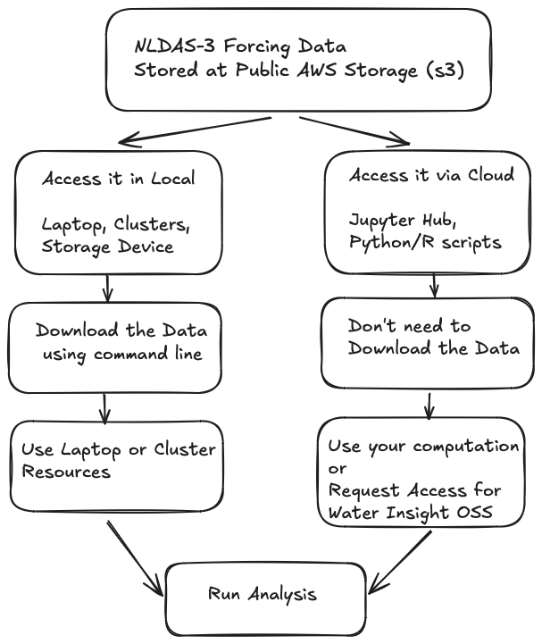

# NLDAS-3
Documentation and discussion on NLDAS (North American Land Data Assimilation System) Phase 3

# NLDAS-3 surface forcing variables


# Structure
- `data_access/`: Contains scripts how to access the data using aws cli.
- `user_data_notebooks/`: Provides notebooks that guide users on how to access and utilize datasets.

# Data Access



You can access NLDAS-3 meteorological model input (forcing) data data using the following methods:

1. **Download data locally**  
   Follow the instructions in [this guide](data_access/1-download_from_aws.md) to download data to your local machine using AWS CLI.
2. **Access data directly from the cloud**  
   Use the example notebook [Read AWS Data](user_data_notebooks/1-read_aws_data.ipynb) to access data in-place without downloading.

# Setup
Follow the following steps to run this project locally on your machine.

## Clone the repository
```sh
git clone git@github.com:NASAWaterInsight/NLDAS-3.git
cd NLDAS-3
```

## Requirements
- `pip install jupyter`

# Contributing
To contribute to this repository:
1. Clone this repository.
2. Branch out from develop to your feature branch.
3. Push your changes to the feature branch.
4. Create a Pull Request (PR) to develop for review.
