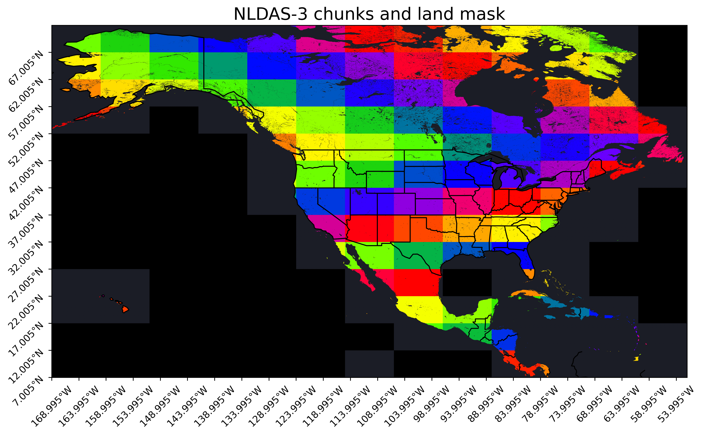

# NLDAS-3

This repository contains documentation and instructions for
accessing preliminary data from the third phase of the
[North American Land Data Assimilation System][1] (NLDAS-3).

The project is currently in active development, working to improve
upon previous versions by:

- Improving the spatial resolution to 1-km.
- Expanding the spatial domain to all of North and Central America.
- Reducing latency.
- Upgrading land surface model processes and parameterization.
- Assimilating a variety of remote sensing data in near real-time.

At this time, only the **beta** forcing data from 2001 to 2023 is
publicly available on AWS. The model outputs for initial runs are in
the final stage of processing, and are expected to be released
mid-2026.

Given that the data is in a beta stage of development, there are
several known issues [tracked in this document][8], and data are
likely to undergo substantial changes before the final release.

We are eager to learn about any other problems encountered by our
users, so please let us know if you discover anything using the
contact methods below.

## Open Science Studio

We are offering free access to cloud resources through the Open
Science Studio (JupyterHub) environment provided by NASA's Science
Managed Cloud Environment (SMCE).

Users are provisioned an on-demand AWS EC2 instance with up to 16 GB
of memory, 10 GB private storage (expandable on an individual basis),
and 4 dedicated processor cores in the `us-west-2` region. Instances
are equipped with a default python environment suitable for
interacting with the NLDAS-3 S3 bucket, and access to shared
Elastic File System (EFS) storage.

This capability is currently under development, and has limitations
including inefficiency for large data egress, and a lack of CPU
persistence when a user is offline. Nonetheless, it offers a way to
quickly interact with and visualize the data, and to collaborate
with other users.

For access to Open Science Studio cloud resources for testing the
data, please fill out the [NLDAS-3 Data Testing Request Form][2],
and we will reach out to you with more information.

## Data Description

   

The NLDAS-3 domain spans 7 to 72 degrees latitude, and -169 to -52
degrees longitude, which is represented on a 6,500 x 11,700 point
grid with 26,546,611 valid land points.

Ultimately, the dataset will support all the forcing, land surface
model, and routing model outputs
[tabulated on this page](info/variables.md).

Data are separated into hourly, daily, and monthly aggregated time
periods.

With the exception of precipitation, all of the data variables
represent the mean value within the UTC time period they represent.
Precipitation, however, provides the total accumulation over the
relevant UTC time period. Daily data also includes the minimum and
maximum values 2-meter temperature for that day.

In order to support efficient access for multiple use cases, forcing
data are chunked into memory-adjacent blocks with shape
(6, 500, 900, 1) with respect to the (time, latitude, longitude,
variable) axes.

## Data Access

### AWS Bucket Contents

The beta forcing data is available in an AWS s3 bucket under
`s3://nasa-waterinsight/NLDAS3/forcing/`, with subdirectories
(keys) for multiple temporal resolutions as described below.

| resolution | file size | extension from `s3://nasa-waterinsight/NLDAS3/forcing/` |
| --- | --- | --- |
| **hourly** | ~12.8 GB | `hourly/{yyyymm}/NLDAS_FOR0010_H.A{yyyymmdd}.030.beta.nc` |
| **daily** | ~700 MB | `daily/{yyyymm}/NLDAS_FOR0010_D.A{yyyymmdd}.030.beta.nc` |
| **monthly** | ~575 MB | `monthly/{yyyy}/NLDAS_FOR0010_M.A{yyyymm}.030.beta.nc` |

Here, the curly-braced values are placeholders for fixed-width
integer dates.

In case you are a GrADS user, the AWS bucket endpoints also contain
.xdf template files so that you can use `xdfopen`.

Simple static parameter data is also available in the s3 bucket under
`s3://nasa-waterinsight/NLDAS3/static/NLDAS-3_dominant-soil-vegetation.nc`,
which contains integer classes for soil texture and surface type
alongside the latitude and longitude coordinates over the full
domain.

Static data that has been tiled for routing is accessible at
`s3://nasa-waterinsight/NLDAS3/static/lis_input.nldas3.noahmp401.1km.hymap.nc`,
which contains land mask, surface class, soil texture, surface
geometry, catchment ID, and other time-invariant parameters relevant
for land surface and routing model calculations.

### Multi-file Virtual Zarr Access

In order to more easily index across files and to minimize the total
number of requests needed to retrieve data, we provide a virtual
[Icechunk repo][13] for daily data (and hourly data soon).

This is the access method we recommend for any use case that utilizes
more than a few files. It enables you to treat the entire period of
record as a single xarray Dataset object without actually downloading
any data until you specify a subset and explicitly call `.load()`.
Subsets can be defined and restricted spatially, temporally, and
with a list of variable names.

Refer to [this notebook][14] for a demonstration.

### Access File Subset (s3fs)

Due to the large file sizes, it is often convenient to download a
subset of the data rather than the entire file. The most
widely-recognized way to do so is to open the file's bucket key using
[s3fs][12], which allows you to treat it like a file stored on your
local file system. This enables you to take advantage of the
memory-mapping ability of the HDF/netCDF format.

This method is more succinct than the Icechunk-based virtual zarr
approach, but each file must be separately opened and treated
independently.

For a brief worked example using the s3fs approach, see
[this notebook][11], or reference [this one][15] for a more thorough
demonstration.

Subsetting files is also theoretically possible with only the netCDF4
library using http range requests as [described here][10], however
this method has not been thoroughly tested by our team.

### Download Full File (AWS CLI / boto)

If you just want to download an entire data file to your machine, the
most straightforward way to do so is by installing the [AWS CLI][9].

Once the CLI is installed, you can list the bucket content using a
command like the one below. Notice the trailing forward slash in the
bucket key; without it, the content of that subdirectory will not
be listed.

`aws s3 ls --human-readable s3://nasa-waterinsight/NLDAS3/forcing/daily/ --no-sign-request`

Note that the AWS CLI is sensitive to the trailing forward slash in
the bucket key path. Without it, only the "directory" key will be
listed, not the files contained within it.

After you choose an available file or range of files, download them
with the CLI as follows:

`aws s3 cp s3://nasa-waterinsight/NLDAS3/forcing/daily/201007/NLDAS_FOR0010_H.A20100722.030.beta.nc . --no-sign-request`

The `--recursive` flag will enable you to download all files under a
particular "directory" within the s3 bucket.

## More Resources

- [Main project website](https://ldas.gsfc.nasa.gov/nldas/v3)
- [Earthdata Story on NLDAS-3](https://www.earthdata.nasa.gov/dashboard/stories/nldas)
- [Stakeholder workshop slides (4/10/2025)](https://ldas.gsfc.nasa.gov/sites/default/files/ldas/nldas/NLDAS-3_Drought-Workshop-3_Slides.pdf)
- [ARSET training on soil moisture for drought](https://appliedsciences.nasa.gov/get-involved/training/english/arset-application-nasa-sport-land-information-system-sport-lis-soil)

## Contact

We sincerely appreciate all user feedback; if you would like to share
your use cases and ideas for the future of this product, please fill
out the [user feedback form][3].

**Technical Contact**: David Mocko ([david.mocko@nasa.gov][4])

**Cloud Contact**: Mitchell Dodson ([mitchell.t.dodson@nasa.gov][5])

**Project PI**: Dr. Sujay Kumar ([sujay.v.kumar@nasa.gov][6])

**Project PI**: Dr. Chris Hain ([christopher.hain@nasa.gov][7])

[1]:https://ldas.gsfc.nasa.gov/nldas/v3
[2]:https://docs.google.com/forms/d/e/1FAIpQLScCCr5yxm0K8JsB8tnUwiRhxOCDXoeSry9hWqe0nYZYIzSv1g/viewform
[3]:https://docs.google.com/forms/d/e/1FAIpQLScL_LNT-YtKjQWiXqNOLak4JFxd5ETWvA3P7KzxK_WSE1swGg/viewform
[4]:mailto:david.mocko@nasa.gov
[5]:mailto:mitchell.t.dodson@nasa.gov
[6]:mailto:sujay.v.kumar@nasa.gov
[7]:mailto:christopher.hain@nasa.gov
[8]:info/known_issues.md
[9]:https://docs.aws.amazon.com/cli/latest/userguide/getting-started-install.html
[10]:https://docs.unidata.ucar.edu/netcdf-c/4.9.2/netcdf_byterange.html
[11]:user_data_notebooks/1-read_aws_data.ipynb
[12]:https://github.com/s3fs-fuse/s3fs-fuse
[13]:https://icechunk.io/en/latest/concepts/
[14]:user_data_notebooks/basic_icechunk_access.ipynb
[15]:user_data_notebooks/basic_s3fs_subgrid_plot.ipynb
